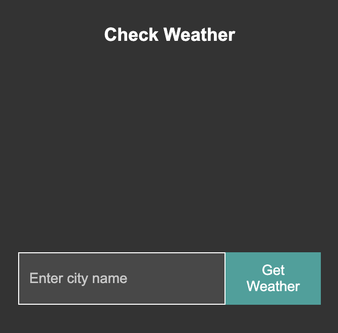
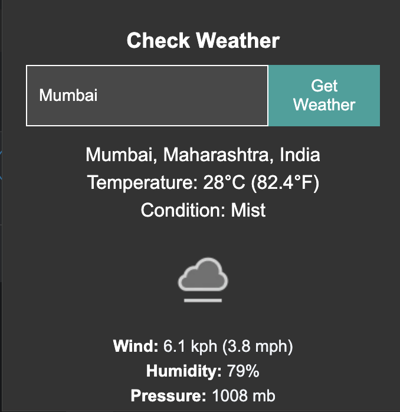

# 🌤️ SkyCast: A Weather Chrome Extension

## Overview
**SkyCast** is a Chrome Extension that allows users to view the current weather conditions of their location or any other city they choose. It uses the WeatherAPI from RapidAPI to fetch real-time weather information and displays it with a clean, user-friendly interface. The extension also supports location-based updates, providing users with weather data of their current location when granted permission.

## Features
- 🌍 **Current Location Weather**: Automatically fetches and displays weather data based on the user's current location.
- 🔍 **City Search**: Users can input any city name to get the latest weather conditions.
- 🎨 **Beautiful UI**: The extension has a minimal and responsive design.
- 💡 **Dynamic Updates**: Automatically updates the weather data when the current location is selected or city name is changed.

## Tech Stack
- **Languages**: HTML, CSS, JavaScript
- **Libraries**: Chrome Extension API
- **Weather API**: WeatherAPI (from RapidAPI)

## Prerequisites
Before installing and running the extension, ensure that you have:
- A valid API key from [RapidAPI](https://rapidapi.com/) for WeatherAPI.
- Chrome Browser (Version 89 or above).

## Installation
1. Clone the repository:
    ```bash
    git clone https://github.com/your-username/skycast-weather-extension.git
    ```

2. Navigate to the project directory:
    ```bash
    cd skycast-weather-extension
    ```

3. Obtain an API key from [RapidAPI](https://rapidapi.com).

4. Replace the placeholder `API_KEY` in `popup.js` with your actual API key.

5. Open Chrome and go to `chrome://extensions/`.

6. Enable **Developer Mode** (top right corner).

7. Click on **Load unpacked** and select the project folder.

8. The extension should now be visible in the Chrome extensions bar!

## Usage
1. Click on the SkyCast extension icon in the toolbar.
2. Either click on the "Current Location" button to automatically fetch your weather, or type in a city name and hit "Enter".
3. The UI will dynamically display the temperature, weather condition, and other relevant details.

## Screenshots
### SkyCast Interface


> *Description: A snapshot of SkyCast.*

### City Search Functionality


> *Description: SkyCast displaying weather information for a user-provided city.*

## Contributing
Contributions are welcome! If you'd like to improve the extension or add new features:
1. Fork the repository.
2. Create a new branch (`feature/your-feature-name`).
3. Commit your changes.
4. Create a Pull Request.

## License
This project is licensed under the MIT License - see the [LICENSE](LICENSE) file for details.
